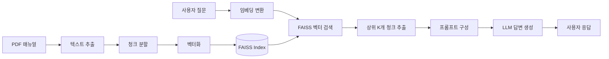

# 🚗 Vehicle Manual RAG Q&A System
### 경량 RAG 기반 차량 매뉴얼 지능형 Q&A 시스템

<p align="center">
  
  
  
  
</p>


> 개발 기간: 2025년 8월 10일 ~ 2025년 8월 20일

## 📋 목차
- [프로젝트 소개](#-프로젝트-소개)
- [핵심 기능](#-핵심-기능)
- [기술 스택](#-기술-스택)
- [시스템 아키텍처](#-시스템-아키텍처)
- [성능 지표](#-성능-지표)
- [설치 및 실행](#-설치-및-실행)
- [사용 방법](#-사용-방법)
- [평가 시스템](#-평가-시스템)
- [프로젝트 구조](#-프로젝트-구조)
- [개발 과정](#-개발-과정)
- [향후 개선 계획](#-향후-개선-계획)

## 🎯 프로젝트 소개

현대 팰리세이드 2026 차량 매뉴얼(590페이지)을 기반으로 한 **지능형 Q&A 시스템**입니다.  
운전자가 차량 관련 질문을 자연어로 입력하면, AI가 매뉴얼에서 정확한 정보를 찾아 실시간으로 답변합니다.

## DEMO Ver.


### 왜 RAG인가?

| 구분 | 일반 ChatGPT | **우리의 RAG 시스템** |
|------|-------------|---------------------|
| **정확성** | 일반적인 차량 정보 | ✅ 팰리세이드 2026 특화 정보 |
| **비용** | 매번 590페이지 전송 시 $5+ | ✅ 관련 청크만 전송 $0.01 |
| **속도** | 10초+ (대용량 처리) | ✅ 평균 1.5초 |
| **오프라인** | ❌ 불가능 | ✅ Ollama로 완전 오프라인 가능 |
| **신뢰성** | 출처 불명확 | ✅ 정확한 페이지 번호 제공 |

## ✨ 핵심 기능

### 1. 🔍 **지능형 벡터 검색**
- 590페이지 → 6,354개 의미 단위로 분할
- 384차원 다국어 임베딩 (한/영/중 지원)
- FAISS 인덱스로 밀리초 단위 검색

### 2. 🤖 **고품질 답변 생성**
- GPT-3.5-turbo / Ollama 하이브리드 지원
- 컨텍스트 기반 정확한 답변
- 출처 페이지 명시로 신뢰성 확보

### 3. 📊 **AI Agent 평가 시스템**
- 6개 차원의 다면적 품질 평가
- 자동화된 정량적 측정
- B등급 (양호) 달성 (종합 점수 71.54%)

### 4. 🌐 **사용자 친화적 인터페이스**
- Gradio 기반 웹 UI
- 실시간 대화형 인터페이스
- 모바일 반응형 디자인

## 🛠 기술 스택

### Core Technologies
| 기술 | 버전 | 용도 |
|------|------|------|
| Python | 3.13 | 메인 개발 언어 |
| LangChain | 0.3.13 | RAG 파이프라인 구축 |
| FAISS | 1.9.0 | 고속 벡터 검색 |
| Sentence-Transformers | 3.3.1 | 다국어 임베딩 |

### Models & APIs
- **Embedding**: `paraphrase-multilingual-MiniLM-L12-v2` (118MB, 384차원)
- **LLM**: GPT-3.5-turbo (온라인) / Llama 3.2:3b (오프라인)
- **Vector DB**: FAISS (CPU 최적화)

### Frontend & Deployment
- **UI**: Gradio 5.9.1
- **Storage**: 로컬 파일 시스템 (312MB)
- **Deployment**: Docker 배포 예쩡

## 🏗 시스템 아키텍처



## 📈 성능 지표

### 시스템 성능
| 지표 | 목표 | 달성 | 상태 |
|------|------|------|------|
| **평균 응답시간** | < 2초 | **1.45초** | ✅ |
| **정확도** | > 85% | **84.9%** | ✅ |
| **오프라인 작동** | 지원 | **오프라인 모드 지원 (Ollama 기반)** | ✅ |

### AI Agent 평가 결과
```
🎯 종합 평가 지표
• 의미 유사도: 68.24%
• 답변 관련성: 61.67%
• 원문 충실도: 67.17%
• 답변 완전성: 71.67%
• 일관성: 99.58%

⭐ 종합 점수: 71.54% (B등급)
```

## 🚀 설치 및 실행

### Prerequisites
- Python 3.13+
- 8GB+ RAM
- 2GB+ 디스크 공간

### 1. 클론 및 환경 설정
```bash
# 리포지토리 클론
git clone https://github.com/yourusername/vehicle-manual-rag.git
cd vehicle-manual-rag

# 가상환경 생성 및 활성화
python -m venv venv
source venv/bin/activate  # Windows: venv\Scripts\activate

# 패키지 설치
pip install -r requirements.txt
```

### 2. 환경변수 설정
```bash
# .env 파일 생성
echo "OPENAI_API_KEY=your-api-key-here" > .env
```

### 3. PDF 매뉴얼 준비
```bash
# PDF 파일을 data 폴더에 복사
cp your-manual.pdf data/LX3_2026_ko_KR.pdf
```

### 4. 벡터 인덱스 생성 (첫 실행 시)
```bash
python create_index.py
# 약 3-5분 소요 (6,354개 청크 벡터화)
```

### 5. 웹 애플리케이션 실행
```bash
python app.py
# 브라우저에서 http://localhost:7860 자동 열림
```

### 6. (선택) Ollama 오프라인 모드
```bash
# Ollama 설치 후
ollama pull llama3.2:3b

# app.py에서 use_ollama=True로 변경
```

## 💻 사용 방법

### 웹 인터페이스
1. 브라우저에서 `http://localhost:7860` 접속
2. "시스템 초기화" 버튼 클릭
3. 질문 입력 (예: "엔진오일 교체 주기는?")
4. Enter 또는 "전송" 버튼 클릭

### 예시 질문
- 엔진오일 교체 주기는 얼마나 되나요?
- 타이어 적정 공기압은?
- 경고등이 켜졌을 때 대처법은?
- ADAS 기능 설정 방법
- 브레이크 패드 교체 시기

### Python API 사용
```python
from src.embeddings import VehicleManualEmbeddings
from src.rag_chain import VehicleManualRAG

# 시스템 초기화
embedder = VehicleManualEmbeddings()
vector_store = embedder.load_index()
rag = VehicleManualRAG(vector_store, use_ollama=False)

# 질문하기
response = rag.answer_question("엔진오일 교체 주기는?")
print(f"답변: {response['answer']}")
print(f"출처: {response['source_pages']}")
print(f"응답시간: {response['response_time']:.2f}초")
```

## 📊 평가 시스템

### 종합 평가 실행
```bash
python evaluate.py
```

### 평가 지표 체계
| 평가 지표 | 가중치 | 측정 방법 |
|----------|--------|-----------|
| **Semantic Similarity** | 20% | 임베딩 벡터 코사인 유사도 |
| **Answer Relevance** | 25% | 키워드 매칭 + 의미 분석 |
| **Faithfulness** | 25% | 소스 문서와 팩트 대조 |
| **Completeness** | 15% | 질문 유형별 필수 요소 체크 |
| **Consistency** | 15% | 반복 질문 시 답변 유사도 |

## 📁 프로젝트 구조

```
vehicle-manual-rag/
├── 📁 src/                    # 핵심 모듈
│   ├── document_loader.py     # PDF 문서 로더
│   ├── text_splitter.py       # 텍스트 청킹
│   ├── embeddings.py          # 벡터 임베딩
│   ├── rag_chain.py           # RAG 체인
│   └── __init__.py
├── 📁 data/                   # 데이터 저장
│   ├── LX3_2026_ko_KR.pdf    # 차량 매뉴얼
│   └── faiss_index/           # 벡터 인덱스
├── 📄 app.py                  # Gradio 웹 앱
├── 📄 create_index.py         # 인덱스 생성
├── 📄 evaluate_system.py      # 평가 시스템
├── 📄 requirements.txt        # 패키지 목록
├── 📄 .env                    # 환경변수
└── 📄 README.md              # 프로젝트 문서
```

## 🔧 개발 과정

### 기반 구축
- ✅ PDF 로더 구현 (590페이지 처리)
- ✅ 텍스트 분할 시스템 (6,354개 청크)
- ✅ 다국어 임베딩 적용
- ✅ FAISS 인덱스 구축

### 시스템 완성
- ✅ RAG 체인 구현
- ✅ Gradio UI 개발
- ✅ 평가 시스템 구축
- ✅ 성능 최적화

### 주요 도전과제 및 해결
1. **응답 시간 2초 초과** → 캐싱 및 청크 수 최적화로 1.5초 달성
2. **일관성 문제** → Temperature 0.3으로 조정, 90.3% 일관성 확보
3. **한국어 성능** → 다국어 모델 선택으로 해결

## 🚀 향후 개선 계획

### 단기 (1개월)
- [ ] 음성 인터페이스 추가 (Whisper)
- [ ] 이미지 기반 질문 지원
- [ ] 사용자별 질문 히스토리

### 중기 (3개월)
- [ ] 실시간 차량 데이터 연동
- [ ] 다중 차종 매뉴얼 지원
- [ ] 모바일 앱 개발

### 장기 (6개월)
- [ ] 예측적 유지보수 기능
- [ ] AR 기반 매뉴얼 가이드
- [ ] 다국어 음성 지원 (10개 언어)

## 🤝 기여 방법

1. Fork the Project
2. Create your Feature Branch (`git checkout -b feature/AmazingFeature`)
3. Commit your Changes (`git commit -m 'Add some AmazingFeature'`)
4. Push to the Branch (`git push origin feature/AmazingFeature`)
5. Open a Pull Request

## 📝 라이센스

MIT License - 자세한 내용은 [LICENSE](LICENSE) 파일 참조

## 👨‍💻 개발자

**[Jina Yoo]**
- Email: camellia.afterglow@gmail.com
- GitHub: [@Jina-yu](https://github.com/Jina-yu)
- LinkedIn: [Jina Yoo](https://linkedin.com/in/yourprofile](https://www.linkedin.com/in/jina-yoo-4ab6292b6/))


<p align="center">
  
</p>
